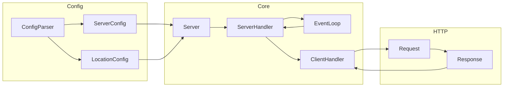
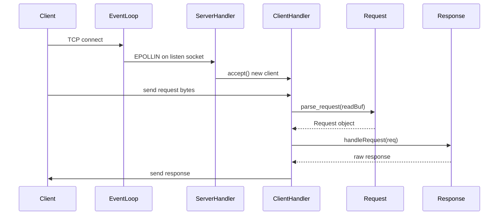
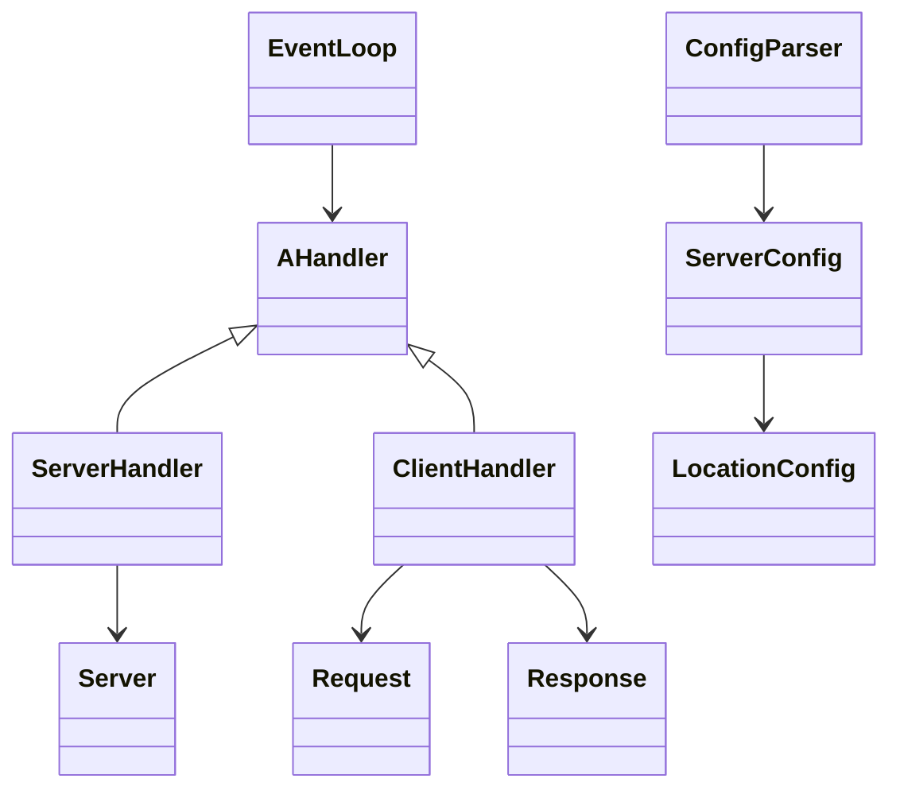
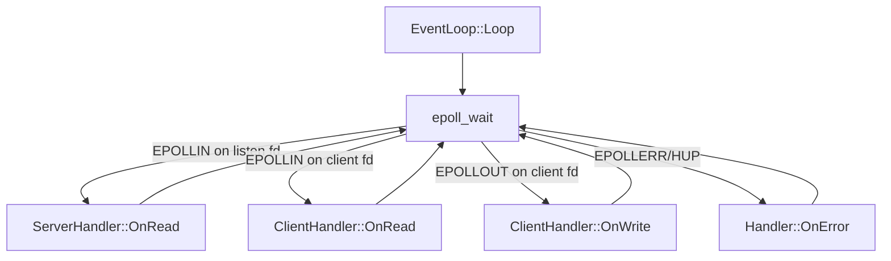

# Webserv Project Documentation

## Project Overview
This project is a C++98 HTTP server that aims to implement a subset of Nginx-like behavior. It parses a custom config file, opens one or more listening sockets, accepts client connections using an epoll-based event loop, and will parse HTTP requests and build HTTP responses.

At the moment, the project has a working config parser, working socket setup, and a functional epoll loop with accept handling. The request parser and response builder exist but are not yet wired into the live client handler.

## Global Architecture
The server uses an event-driven architecture:

- A config parser builds `ServerConfig` and `LocationConfig` objects.
- Each configured server creates a listening socket.
- A single `EventLoop` (epoll) waits for readiness events.
- Each listening socket is handled by a `ServerHandler`.
- Each accepted client socket is handled by a `ClientHandler`.
- Requests should be parsed from client data and responses should be written back.

## Project Structure
- Build and entry point
  - [Makefile](Makefile): C++98 build rules and target `webserv`.
  - [src/main.cpp](src/main.cpp): Bootstraps config parsing, server setup, and event loop.
- Configuration
  - [Config/configFile.conf](Config/configFile.conf): Example config file with multiple servers and locations.
  - [inc/configParser.hpp](inc/configParser.hpp), [src/Server/configParser.cpp](src/Server/configParser.cpp): Tokenize and parse config into objects.
  - [inc/serverConfig.hpp](inc/serverConfig.hpp), [src/Server/serverConfig.cpp](src/Server/serverConfig.cpp): Global server settings model.
  - [inc/locationConfig.hpp](inc/locationConfig.hpp), [src/Server/locationConfig.cpp](src/Server/locationConfig.cpp): Per-location settings model.
- Core server and event loop
  - [inc/EventLoop.hpp](inc/EventLoop.hpp), [src/Multiplexer/EventLoop.cpp](src/Multiplexer/EventLoop.cpp): epoll wrapper and event dispatch.
  - [inc/AHandler.hpp](inc/AHandler.hpp), [src/Multiplexer/AHandler.cpp](src/Multiplexer/AHandler.cpp): Base handler for sockets.
  - [inc/Server.hpp](inc/Server.hpp), [src/Server/Server.cpp](src/Server/Server.cpp): Listening socket setup and lifecycle.
  - [inc/Server_Handler.hpp](inc/Server_Handler.hpp), [src/Multiplexer/Server_Handler.cpp](src/Multiplexer/Server_Handler.cpp): Accepts new clients.
  - [inc/Client.hpp](inc/Client.hpp), [src/Multiplexer/Client.cpp](src/Multiplexer/Client.cpp): Client read/write handling.
- HTTP parsing and response
  - [inc/Request.hpp](inc/Request.hpp), [src/Request_Responce/Request.cpp](src/Request_Responce/Request.cpp), [src/Request_Responce/Request_getset.cpp](src/Request_Responce/Request_getset.cpp): Request parsing and validation helpers.
  - [inc/Response.hpp](inc/Response.hpp), [src/Request_Responce/Response.cpp](src/Request_Responce/Response.cpp), [src/Request_Responce/Response_getset.cpp](src/Request_Responce/Response_getset.cpp): Response generation for GET (partial).
- Static content
  - [www/index.html](www/index.html), [www/index.js](www/index.js): Placeholder web root files.
- Scratch files
  - [test.cpp](test.cpp): Local experiments, not part of the build.
  - [todo](todo): Short progress notes.

## How Everything Works (End-to-End)

### 1) Config parsing
- `ConfigParser` tokenizes the config file and builds a list of `ServerConfig` objects.
- Each `server {}` block produces a `ServerConfig`.
- Each `location {}` block produces a `LocationConfig` stored in the server.

### 2) Server initialization
- `main.cpp` constructs a `Server` object for each `ServerConfig`.
- Each `Server` opens and configures a listening socket (bind + listen + non-blocking).

### 3) Event loop setup
- `EventLoop` owns a single epoll instance.
- Each listening socket gets a `ServerHandler` that registers for `EPOLLIN` events.

### 4) Client connection handling
- When a listening socket becomes readable, `ServerHandler::OnRead()` accepts the client.
- A new `ClientHandler` is created and registered with epoll.

### 5) Request parsing (planned integration)
- `ClientHandler::OnRead()` appends data into `readBuf`.
- The `Request::parse_request()` function can parse a full HTTP request from a buffer.
- The next step is to call `Request::parse_request()` when enough data is available.

### 6) Routing (planned integration)
- Request path and method should be matched against `ServerConfig` and `LocationConfig`.
- Rules like `root`, `index`, and `allow_methods` decide the final action.

### 7) Response generation
- `Response::handleRequest()` dispatches to method handlers (only GET implemented).
- `Response::buildRawResponse()` builds the HTTP response string.

### 8) Sending responses
- `ClientHandler::OnWrite()` sends `writeBuf` until empty.
- This is where the response string should be stored once built.

## Internal Data Flow
1. Socket ready event in epoll.
2. `ServerHandler` accepts a client connection.
3. `ClientHandler` reads bytes into `readBuf`.
4. `Request` parses a full HTTP request from `readBuf`.
5. Routing selects location and maps URI to a local path.
6. `Response` builds headers + body.
7. Response string is placed into `writeBuf`.
8. `ClientHandler` sends the response and returns to `EPOLLIN`.

## Diagrams

### Architecture Overview

### Request Lifecycle

### Class Relationships

### Event Loop Flow

## Current Progress
- Config parsing is complete and supports multiple servers and locations.
- Listening sockets are created with non-blocking mode and `SO_REUSEADDR`.
- Epoll loop is set up and can accept new connections.
- Request parsing logic exists for request line, headers, and body (including chunked).
- GET response handling exists and can read files from a root path.

## Remaining Work (Suggested Priority)
1. Integrate request parsing into [src/Multiplexer/Client.cpp](src/Multiplexer/Client.cpp) so each client builds a `Request` from `readBuf`.
2. Build routing logic that selects the correct `ServerConfig` + `LocationConfig` for each request.
3. Use config values for `root`, `index`, `error_page`, and `client_max_body_size` when generating responses.
4. Implement POST and DELETE flows, including upload handling and delete safety.
5. Implement autoindex and redirect handling for directory requests.
6. Add correct HTTP status handling and error pages.
7. Implement keep-alive and request pipelining behavior.

## Code Quality Review

### Findings (ordered by severity)
- Client sockets are not closed on cleanup, which will leak file descriptors for each client. The base class destructor does not close the fd and the client handler destructor is empty. See [src/Multiplexer/AHandler.cpp](src/Multiplexer/AHandler.cpp#L15-L18) and [src/Multiplexer/Client.cpp](src/Multiplexer/Client.cpp#L14-L58).
- Client reads never parse a request or build a response, so every connection can only log data and never reply. This means the server is not functional for real HTTP requests yet. See [src/Multiplexer/Client.cpp](src/Multiplexer/Client.cpp#L16-L36).
- The event loop only calls `OnRead()` when both `EPOLLIN` and `EPOLLOUT` are set, because `EPOLLOUT` is in an `else if`. This can starve writes when a socket is readable and writable at the same time. See [src/Multiplexer/EventLoop.cpp](src/Multiplexer/EventLoop.cpp#L76-L80).
- Response GET handling uses a hardcoded root `www/` instead of `ServerConfig.root` or `LocationConfig.root`, which ignores the parsed config. See [src/Request_Responce/Response.cpp](src/Request_Responce/Response.cpp#L87-L121).
- The accept handler does not handle `EAGAIN` or `EWOULDBLOCK`, which can cause noisy errors on non-blocking sockets under load. See [src/Multiplexer/Server_Handler.cpp](src/Multiplexer/Server_Handler.cpp#L14-L24).

## Learning Section (Simple Explanations)

### Why epoll is used
`epoll` lets one thread manage many sockets. It tells you which sockets are ready to read or write, so you do not block on any single connection.

### Why `AHandler` exists
`AHandler` is a common interface so the event loop can call `OnRead`, `OnWrite`, and `OnError` without knowing if the socket is a server or a client.

### How a single HTTP request is parsed
`Request::parse_request()` looks for the `\r\n\r\n` boundary, parses the request line and headers, then parses the body based on `Content-Length` or `Transfer-Encoding: chunked`.

### Why routing matters
Routing chooses which `LocationConfig` matches the URL path. That decision affects `root`, `index`, allowed methods, and error pages for the response.
