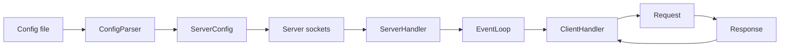
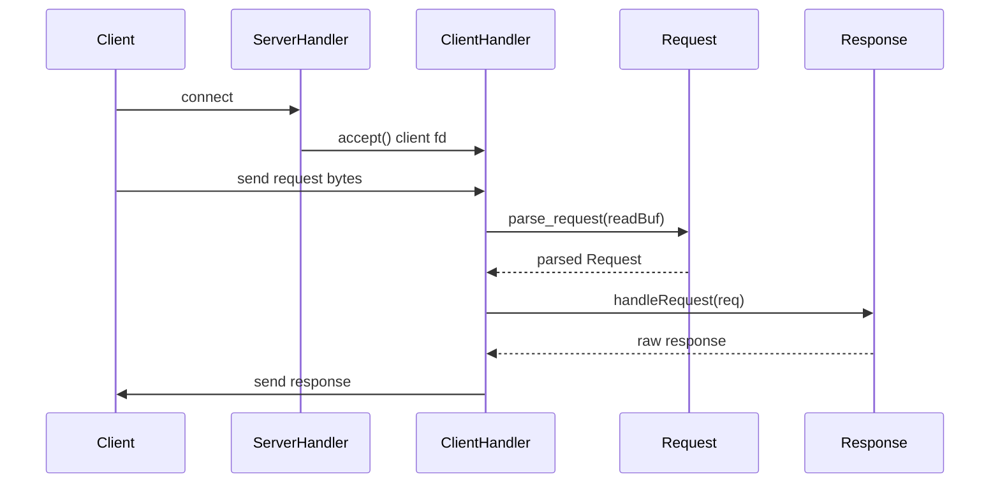
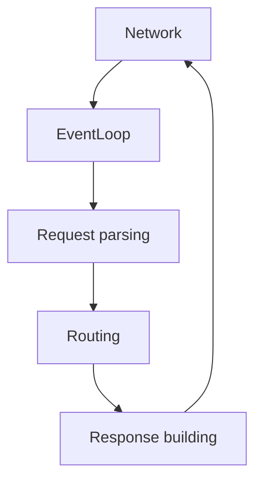

# Webserv Deep Code Guide

This document explains how the code works end-to-end and provides a tagged explanation for every function in the `.cpp` and `.hpp` files. The goal is clarity, not brevity.

## System Overview
The server is event-driven and uses `epoll` to manage many sockets in one thread.

### Architecture diagram

## Request Lifecycle (intended runtime)

## Module-by-module explanation

### Main entry
- [src/main.cpp](src/main.cpp)
  - **Tag:** `main(int ac, char **av)`
    - **Role:** Bootstraps the server. Validates CLI arguments, parses the config, creates one `Server` per config, and enters the `EventLoop`.
    - **Key flow:** config parse -> socket init -> handler registration -> epoll loop.

### Event loop and handlers
- [inc/EventLoop.hpp](inc/EventLoop.hpp), [src/Multiplexer/EventLoop.cpp](src/Multiplexer/EventLoop.cpp)
  - **Tag:** `EventLoop::EventLoop()`
    - **Role:** Creates an epoll instance and throws on failure.
  - **Tag:** `EventLoop::~EventLoop()`
    - **Role:** Closes the epoll fd if open.
  - **Tag:** `EventLoop::GetFd() const`
    - **Role:** Returns the epoll fd (mostly for debugging or extensions).
  - **Tag:** `EventLoop::AddHandler(AHandler* handler, uint32_t flags) const`
    - **Role:** Registers a socket in epoll with the desired events.
  - **Tag:** `EventLoop::ModHandler(AHandler* handler, uint32_t flags) const`
    - **Role:** Updates epoll interest (read/write).
  - **Tag:** `EventLoop::RemoveHandler(AHandler* handler) const`
    - **Role:** Removes a handler from epoll.
  - **Tag:** `EventLoop::Loop()`
    - **Role:** Waits for epoll events and dispatches to `OnRead`, `OnWrite`, or `OnError`.

- [inc/AHandler.hpp](inc/AHandler.hpp), [src/Multiplexer/AHandler.cpp](src/Multiplexer/AHandler.cpp)
  - **Tag:** `AHandler::AHandler(int fd, ServerConfig &config, EventLoop &loop)`
    - **Role:** Base handler constructor. Stores fd, config, loop, and enables non-blocking mode.
  - **Tag:** `AHandler::~AHandler()`
    - **Role:** Base destructor (does not close fd right now).
  - **Tag:** `AHandler::EnableWrite()`
    - **Role:** Switches epoll interest to read+write.
  - **Tag:** `AHandler::DisableWrite()`
    - **Role:** Switches epoll interest back to read only.
  - **Tag:** `AHandler::GetFd() const`
    - **Role:** Exposes the underlying fd.
  - **Tag:** `AHandler::GetServerConf() const`
    - **Role:** Gives access to the `ServerConfig` associated with this handler.
  - **Tag:** `AHandler::SetNonBlocking() const`
    - **Role:** Sets O_NONBLOCK and FD_CLOEXEC on the fd.

- [inc/Server_Handler.hpp](inc/Server_Handler.hpp), [src/Multiplexer/Server_Handler.cpp](src/Multiplexer/Server_Handler.cpp)
  - **Tag:** `ServerHandler::ServerHandler(int fd, ServerConfig &config, EventLoop &loop)`
    - **Role:** Registers the listening socket for read events.
  - **Tag:** `ServerHandler::~ServerHandler()`
    - **Role:** Closes the listening socket fd.
  - **Tag:** `ServerHandler::OnRead()`
    - **Role:** Accepts new client connections and constructs a `ClientHandler` for each.
  - **Tag:** `ServerHandler::OnWrite()`
    - **Role:** No-op for listening sockets.
  - **Tag:** `ServerHandler::OnError()`
    - **Role:** Removes itself from epoll and deletes the handler.

- [inc/Client.hpp](inc/Client.hpp), [src/Multiplexer/Client.cpp](src/Multiplexer/Client.cpp)
  - **Tag:** `ClientHandler::ClientHandler(int fd, ServerConfig &config, EventLoop &loop, const sockaddr_in &addr, socklen_t addrLen)`
    - **Role:** Registers a client socket for read events.
  - **Tag:** `ClientHandler::~ClientHandler()`
    - **Role:** Empty; cleanup happens in `OnError` right now.
  - **Tag:** `ClientHandler::OnRead()`
    - **Role:** Reads bytes into `readBuf`. This is where request parsing should be called.
  - **Tag:** `ClientHandler::OnWrite()`
    - **Role:** Sends `writeBuf` to the client until empty; disables write events when done.
  - **Tag:** `ClientHandler::OnError()`
    - **Role:** Removes the handler from epoll and deletes it.

### Server socket
- [inc/Server.hpp](inc/Server.hpp), [src/Server/Server.cpp](src/Server/Server.cpp)
  - **Tag:** `Server::Server(ServerConfig &servers)`
    - **Role:** Stores the server config and initializes fd to -1.
  - **Tag:** `Server::~Server()`
    - **Role:** Closes the listening fd when the server object is destroyed.
  - **Tag:** `Server::SetNonBlocking() const`
    - **Role:** Sets O_NONBLOCK and FD_CLOEXEC on the listening socket.
  - **Tag:** `Server::initialize_socket()`
    - **Role:** Resolves address, creates socket, sets SO_REUSEADDR, binds, listens, and makes it non-blocking.
  - **Tag:** `Server::GetFd() const`
    - **Role:** Returns the listening socket fd.
  - **Tag:** `Server::GetConfig()`
    - **Role:** Returns the config associated with this server.

### Config models
- [inc/serverConfig.hpp](inc/serverConfig.hpp), [src/Server/serverConfig.cpp](src/Server/serverConfig.cpp)
  - **Tag:** `ServerConfig::ServerConfig()`
    - **Role:** Sets defaults: host `0.0.0.0`, port `80`, and size limits.

- [inc/locationConfig.hpp](inc/locationConfig.hpp), [src/Server/locationConfig.cpp](src/Server/locationConfig.cpp)
  - **Tag:** `LocationConfig::LocationConfig()`
    - **Role:** Sets default values for a location block.

### Config parsing
- [inc/configParser.hpp](inc/configParser.hpp), [src/Server/configParser.cpp](src/Server/configParser.cpp)
  - **Tag:** `ConfigParser::ConfigParser(const std::string &filename)`
    - **Role:** Stores the filename and triggers parsing.
  - **Tag:** `ConfigParser::getServers() const`
    - **Role:** Returns the vector of parsed `ServerConfig` objects.
  - **Tag:** `ConfigParser::trim(const std::string &s)`
    - **Role:** Utility to remove leading/trailing whitespace.
  - **Tag:** `ConfigParser::removeSemicolon(const std::string &s)`
    - **Role:** Utility to drop trailing semicolons.
  - **Tag:** `ConfigParser::splitLine(const std::string &line, char delimiter)`
    - **Role:** Utility to split a line into tokens.
  - **Tag:** `ConfigParser::parseServerLine(const std::string &key, const std::vector<std::string> &words, ServerConfig &server)`
    - **Role:** Handles server-level directives (listen, root, index, error_page, etc.).
  - **Tag:** `ConfigParser::parseLocationLine(const std::string &key, const std::vector<std::string> &words, LocationConfig &location)`
    - **Role:** Handles location-level directives.
  - **Tag:** `ConfigParser::tokenize()`
    - **Role:** Converts the file into a token stream with braces and semicolons as tokens.
  - **Tag:** `ConfigParser::parse()`
    - **Role:** Parses tokens into server and location objects using a small state machine.

### Request parsing
- [inc/Request.hpp](inc/Request.hpp), [src/Request_Responce/Request.cpp](src/Request_Responce/Request.cpp), [src/Request_Responce/Request_getset.cpp](src/Request_Responce/Request_getset.cpp)
  - **Tag:** `Request::Request()`
    - **Role:** Initializes an empty request with method `UNKNOWN`.
  - **Tag:** `Request::~Request()`
    - **Role:** Trivial destructor.
  - **Tag:** `Request::setMethod(e_Methodes method)`
    - **Role:** Sets the parsed method enum.
  - **Tag:** `Request::setUri(const std::string &uri)`
    - **Role:** Stores the raw URI.
  - **Tag:** `Request::setVersion(const std::string &version)`
    - **Role:** Stores the HTTP version.
  - **Tag:** `Request::setQuery(const std::string &query)`
    - **Role:** Stores the query string part of the URI.
  - **Tag:** `Request::setPath(const std::string &path)`
    - **Role:** Stores the path part of the URI.
  - **Tag:** `Request::setBody(const std::string &body)`
    - **Role:** Stores the request body.
  - **Tag:** `Request::setHeader(std::string key, std::string value)`
    - **Role:** Inserts or merges headers and checks duplicates for `Host` and `Content-Length`.
  - **Tag:** `Request::setHeaders(const std::map<std::string, std::string> &headers)`
    - **Role:** Replaces the entire header map.
  - **Tag:** `Request::getMethod() const`
    - **Role:** Returns the method enum.
  - **Tag:** `Request::getUri() const`
    - **Role:** Returns the URI string.
  - **Tag:** `Request::getVersion() const`
    - **Role:** Returns HTTP version.
  - **Tag:** `Request::getQuery() const`
    - **Role:** Returns the query string.
  - **Tag:** `Request::getPath() const`
    - **Role:** Returns the path portion.
  - **Tag:** `Request::getBody() const`
    - **Role:** Returns the body string.
  - **Tag:** `Request::getHeaders() const`
    - **Role:** Returns the header map.
  - **Tag:** `Request::removeHeader(const std::string &key)`
    - **Role:** Erases a header entry.
  - **Tag:** `Request::display() const`
    - **Role:** Debug output of the parsed request.
  - **Tag:** `Request::parse_request_line(const std::string &req_line)`
    - **Role:** Parses method, URI, and version from the request line.
  - **Tag:** `Request::parse_request_headers_helper(const std::string &header, size_t startIndex)`
    - **Role:** Helper to validate folding/whitespace sequences.
  - **Tag:** `Request::skip_whitespace(const std::string &header, size_t &i)`
    - **Role:** Skips spaces and tabs while parsing headers.
  - **Tag:** `Request::parse_request_headers(const std::string &header)`
    - **Role:** Parses header lines and validates `Host`, `Content-Length`, and `Transfer-Encoding`.
  - **Tag:** `Request::convert_hex_to_dec(const std::string &hex)`
    - **Role:** Converts chunk sizes for `Transfer-Encoding: chunked`.
  - **Tag:** `Request::parse_body(const std::string &body, size_t &consumed_bytes)`
    - **Role:** Parses body using `Content-Length` or chunked encoding and reports consumed bytes.
  - **Tag:** `Request::validateRequest()`
    - **Role:** Validates version, method, URI length, body size, and Host header.
  - **Tag:** `Request::parse_request(std::string &raw)`
    - **Role:** Parses exactly one request from a raw buffer, then removes parsed bytes.

### Response building
- [inc/Response.hpp](inc/Response.hpp), [src/Request_Responce/Response.cpp](src/Request_Responce/Response.cpp), [src/Request_Responce/Response_getset.cpp](src/Request_Responce/Response_getset.cpp)
  - **Tag:** `Response::setStatusCode(int code)`
    - **Role:** Stores the HTTP status code.
  - **Tag:** `Response::setReasonPhrase(const std::string &phrase)`
    - **Role:** Stores the status reason phrase.
  - **Tag:** `Response::setHeaders(const std::map<std::string, std::string> &hdrs)`
    - **Role:** Replaces the header map.
  - **Tag:** `Response::setHeader(const std::string &key, const std::string &value)`
    - **Role:** Inserts or overwrites a single header.
  - **Tag:** `Response::setBody(const std::string &content)`
    - **Role:** Stores the response body.
  - **Tag:** `Response::setRawResponse(const std::string &response)`
    - **Role:** Stores the full HTTP response string.
  - **Tag:** `Response::getStatusCode() const`
    - **Role:** Returns the status code.
  - **Tag:** `Response::getReasonPhrase() const`
    - **Role:** Returns the reason phrase.
  - **Tag:** `Response::getHeaders() const`
    - **Role:** Returns the header map.
  - **Tag:** `Response::getBody() const`
    - **Role:** Returns the body string.
  - **Tag:** `Response::getRawResponse() const`
    - **Role:** Returns the final response string.
  - **Tag:** `Response::build_local_path(const std::string &root, const std::string &req_path)`
    - **Role:** Joins root and path to a local file system path.
  - **Tag:** `Response::check_resource(const std::string &local_path)`
    - **Role:** Checks if a path exists, is a directory, or is readable.
  - **Tag:** `Response::get_mime_type(const std::string &path)`
    - **Role:** Maps file extensions to MIME types.
  - **Tag:** `Response::buildRawResponse()`
    - **Role:** Constructs the HTTP response string from status, headers, and body.
  - **Tag:** `Response::current_http_date()`
    - **Role:** Returns a RFC 1123 formatted date string.
  - **Tag:** `Response::handleGet(const Request &req)`
    - **Role:** Loads a static file and builds a 200 OK response (partial logic).
  - **Tag:** `Response::handlePost(const Request &req)`
    - **Role:** Declared but not implemented yet.
  - **Tag:** `Response::handleDelete(const Request &req)`
    - **Role:** Declared but not implemented yet.
  - **Tag:** `Response::generateErrorResponse(int code)`
    - **Role:** Declared but not implemented yet.
  - **Tag:** `Response::handleRequest(const Request &req)`
    - **Role:** Dispatches to method handlers (only GET active).

### Scratch and tests
- [test.cpp](test.cpp)
  - **Tag:** `main()`
    - **Role:** Local experiments for containers and strings (not used by build).

## Where you have reached
- Parsing config files and building server/location objects is complete.
- Epoll event loop, listening sockets, and accepting clients are working.
- Request parsing for headers and body is implemented.
- Static GET response generation exists but is not wired into the client handler.

## What is still left to do (priority order)
1. Connect `Request::parse_request()` in `ClientHandler::OnRead()` and keep a per-client `Request` state.
2. Implement routing to select `ServerConfig` and `LocationConfig` for each request.
3. Use config values (`root`, `index`, `error_page`, `client_max_body_size`) when building responses.
4. Add directory handling (index + autoindex + redirect).
5. Implement POST and DELETE with safety rules.
6. Implement error responses and error page mapping.
7. Add keep-alive and multi-request support.

## Visual mental model

