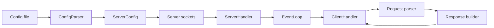
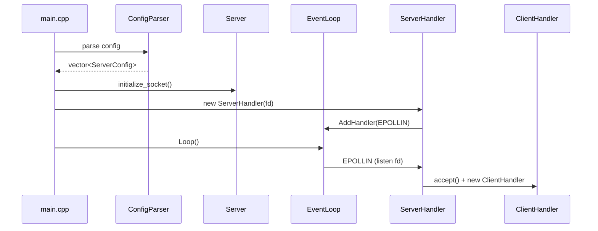
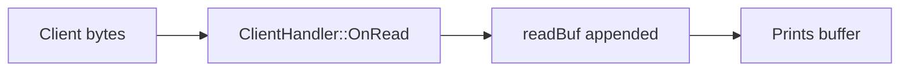
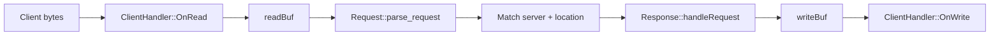
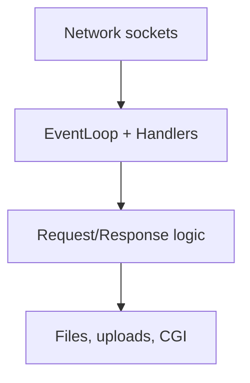

# Webserv Status Overview

This document explains what is already working, how the parts connect, and what is still missing. It is written from scratch and does not rely on the previous docs.

## Big Picture
You are building a small event-driven HTTP server. The core loop is based on `epoll`, which lets one thread manage many sockets. The project already opens sockets, accepts clients, and can parse HTTP requests. The missing part is connecting the request parser and response builder to the client sockets and using config data for routing.

### System map

## What each module is doing

### Config
- `ConfigParser` reads tokens and builds `ServerConfig` and `LocationConfig`.
- Each server block becomes a `ServerConfig` object.
- Each location block is stored inside the server.

### Core runtime
- `Server` creates a TCP socket, binds, listens, and sets non-blocking.
- `EventLoop` wraps `epoll` and dispatches to handlers.
- `ServerHandler` accepts new client connections.
- `ClientHandler` reads and writes raw bytes for each client.

### HTTP logic
- `Request` parses the request line, headers, and body (including chunked).
- `Response` can build a basic GET response for static files.

## Execution flow (from start to first request)

## Request lifecycle (current vs intended)

### Current behavior

### Intended behavior

## Where you are right now (progress)

### Implemented and working
- Config parsing for server/location blocks.
- Socket creation and non-blocking setup.
- Epoll loop and event dispatch.
- Accepting clients.
- HTTP request parsing logic.
- Basic GET response builder for static files.

### Partially implemented
- Response building exists but is not connected to the client handler.
- Directory handling and autoindex are not finished.
- Request validation exists but is not used to reject bad requests.

### Not implemented yet
- Routing (selecting the right server/location for a request).
- POST and DELETE logic.
- Error pages and full status mapping.
- Keep-alive and pipelining behavior.
- CGI and upload_store handling.

## What is still left to do (recommended order)
1. In `ClientHandler::OnRead`, call `Request::parse_request` and keep a `Request` per client.
2. Implement routing: match `Host` and path to `ServerConfig` and `LocationConfig`.
3. Update `Response` to use config data for `root`, `index`, and `error_page`.
4. Handle directory requests: index files, autoindex, and redirects.
5. Implement POST and DELETE flows (uploads + delete safety).
6. Add error responses and status pages.
7. Add keep-alive and multi-request parsing.

## Simple mental model
Think of the server as three layers:

- The **network** layer accepts connections.
- The **event loop** decides which socket to read or write.
- The **HTTP** layer parses and builds responses.
- The **data** layer reads files or runs CGI scripts.
