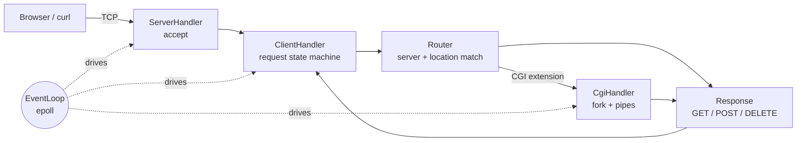

<div align="center">

# 🌐 Webserv

### A non-blocking HTTP/1.1 web server written from scratch in C++98

*Think NGINX, built by hand: sockets, `epoll`, a config parser, CGI, uploads and sessions, with zero external libraries.*


</div>

---

## 📖 About

**Webserv** is a 42 / 1337 school project: write your own HTTP server in **C++98** that can serve real websites to real browsers.

The server runs as a **single process and a single thread**. Every socket is non-blocking and driven by one `epoll` event loop, so thousands of idle connections never block each other. It is configured with an NGINX-style config file and handles static files, uploads, directory listing, redirects, cookies/sessions and CGI scripts.

## ✨ Features

| | Feature | Details |
|---|---|---|
| ⚡ | **Event-driven I/O** | One `epoll` loop, non-blocking sockets, no `fork` per client |
| 🧩 | **NGINX-like config** | Multiple `server` blocks, `location` blocks, custom error pages |
| 📄 | **HTTP methods** | `GET`, `POST`, `DELETE` with per-location `allow_methods` |
| 📁 | **Static files** | MIME-type detection, `index` files, optional **autoindex** |
| 📤 | **File uploads** | `multipart/form-data` and raw body uploads, streamed to disk |
| 🔁 | **Chunked bodies** | `Transfer-Encoding: chunked` decoding |
| 🐍 | **CGI** | `.php`, `.py`, `.pl`, `.cgi` via `fork` / `execve` and pipes, with timeout |
| ↪️ | **Redirections** | `return 301..308 <url>` per location |
| 🍪 | **Cookies & sessions** | `session_id` cookie (`HttpOnly`) with a server-side session tracker |
| 🔌 | **Keep-alive** | Persistent connections, `Connection: close` handling |
| ⏱️ | **Timeouts** | Idle client timeout (`408`) and CGI timeout (`504`) |
| 🛡️ | **Safety checks** | Path traversal blocking, URI/header size limits, body size limits (`413`) |
| 🎨 | **Error pages** | Custom pages from config, with a built-in styled fallback |

## 🏗️ Architecture



Every file descriptor (listening socket, client socket, CGI pipe) is wrapped in a handler that derives from `AHandler` and is registered in the `EventLoop`. Each client parses its request incrementally through a state machine:

```
READING_REQUEST_LINE → READING_HEADERS → HEADERS_DONE → READING_BODY → COMPLETE
                                  └──────────── any error ───────────→ ERROR
```

This makes partial reads, pipelined requests and slow clients work correctly without ever blocking.

## 📂 Project structure

```
.
├── Makefile
├── inc/                      # Headers
└── src/
    ├── main.cpp              # Entry point, signals, server bootstrap
    ├── Multiplexer/          # EventLoop, AHandler, ClientHandler, ServerHandler, CGI
    ├── Request_Responce/     # HTTP request parsing and response building
    └── Server/               # Config parser, Router, ServerConfig / LocationConfig, sessions
```

## 🚀 Getting started

### Requirements
- Linux (uses `epoll`)
- `c++` compiler with C++98 support
- `make`

### Build

```bash
git clone https://github.com/<your-username>/webserv.git
cd webserv
make
```

### Run

```bash
./webserv path/to/config.conf
```

Then open `http://localhost:8080` in your browser (or whichever port you configured).

### Makefile rules

| Rule | Description |
|---|---|
| `make` | Build the `webserv` executable |
| `make clean` | Remove object files |
| `make fclean` | Remove objects and the executable |
| `make re` | Rebuild everything |

## ⚙️ Configuration

The config syntax is inspired by NGINX. Every directive ends with `;`.

```nginx
server {
    listen 127.0.0.1:8080;
    server_name localhost;
    root ./www;
    index index.html;
    client_max_body_size 1000000;
    error_page 404 errors/404.html;

    location / {
        allow_methods GET;
        autoindex on;
    }

    location /upload {
        allow_methods GET POST DELETE;
        upload_store ./www/uploads;
        client_max_body_size 50000000;
    }

    location /cgi-bin {
        allow_methods GET POST;
        cgi_extension .py;
        cgi_path /usr/bin/python3;
    }

    location /old {
        return 301 /new;
    }
}
```

### Server directives

| Directive | Description |
|---|---|
| `listen [host:]port` | Address and port to bind |
| `server_name` | Virtual host name matched against the `Host` header |
| `root` | Document root |
| `index` | Default index file(s) |
| `client_max_body_size` | Max request body size in bytes |
| `error_page <code> <file>` | Custom page for a 4xx/5xx status |

### Location directives

| Directive | Description |
|---|---|
| `root`, `index`, `client_max_body_size` | Override the server-level values |
| `allow_methods` | Any of `GET`, `POST`, `DELETE` |
| `autoindex on\|off` | Directory listing |
| `cgi_extension` | One of `.php`, `.pl`, `.py`, `.cgi` |
| `cgi_path` | Path to the interpreter |
| `upload_store` | Directory where uploads are saved |
| `return <301-308> <url>` | HTTP redirect |

## 🧪 Try it

```bash
# Static page
curl -i http://localhost:8080/

# Upload a file (multipart)
curl -i -F "file=@photo.png" http://localhost:8080/upload

# Raw body upload
curl -i -X POST --data-binary @video.mp4 -H "Content-Type: video/mp4" http://localhost:8080/upload/video.mp4

# Chunked request
curl -i -X POST -H "Transfer-Encoding: chunked" --data "hello" http://localhost:8080/upload/hello.txt

# Delete a file
curl -i -X DELETE http://localhost:8080/upload/hello.txt

# Check the session cookie
curl -i http://localhost:8080/

# Stress test (needs siege)
siege -b -c 100 -t 10S http://localhost:8080/
```

## 🔬 What I learned

- Designing a **non-blocking, event-driven** server around `epoll`
- Parsing HTTP/1.1 **incrementally** (request line, headers, fixed-length and chunked bodies)
- Managing **file descriptor lifetimes**, `fork`/`execve`, pipes and zombie processes for CGI
- Writing a **tokenizer and parser** for a custom configuration language
- Clean **OOP design in C++98**: polymorphic handlers, RAII-style cleanup, no STL containers beyond the standard ones allowed
- Debugging with `gdb` and `Valgrind` to keep the server leak-free

## 🛣️ Possible improvements

- [ ] HTTP/1.1 `Range` requests and caching headers
- [ ] HTTPS / TLS support
- [ ] More CGI environment variables (`HTTP_*` headers)
- [ ] Per-location `index` and `error_page` inheritance rules
- [ ] Automated test suite

## 👤 Author

**Othman Akhmouch**, student at 1337 (42 Network)

[](https://github.com/<your-username>)
[](https://www.linkedin.com/in/<your-handle>)

---

<div align="center">

If you found this project useful or interesting, consider leaving a ⭐

</div>
